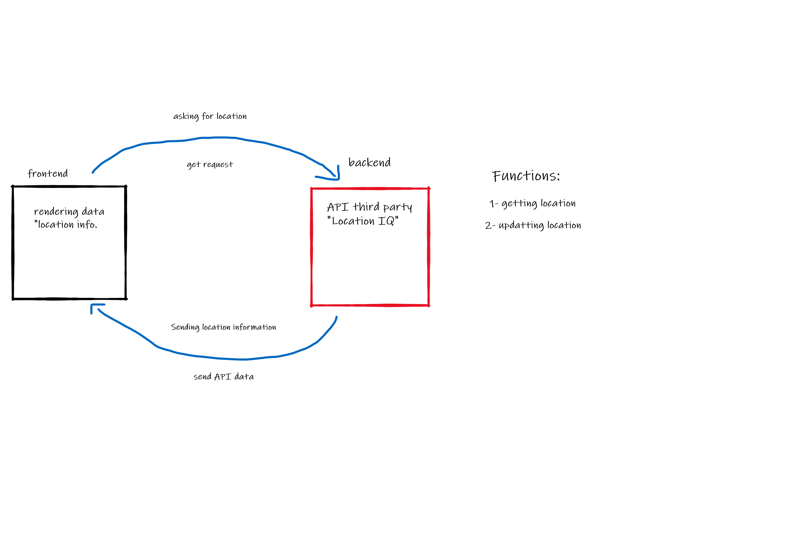

# **City Explorer.**

## Auther : **Zaid Shahrouri**

## Overview
This is an application that uses an API to display a location of users choice.

## Getting Started
1. install a React template
2. build the structure of the app
3. find an API and get a key
4. import axios into your react app
5. identify the parts in the API URL that need to be changed in the GET API link to be useful
6. create functions to change the API parts.
7. render your app
8. connect thr front end to NETLIFY. com

## Architecture
- react library
- axios library
- react.bootstrap library
- CSS
- JavaScript
- HTML

## Credit and Collaborations:
- ASAC team
- Mohammad Harb .

